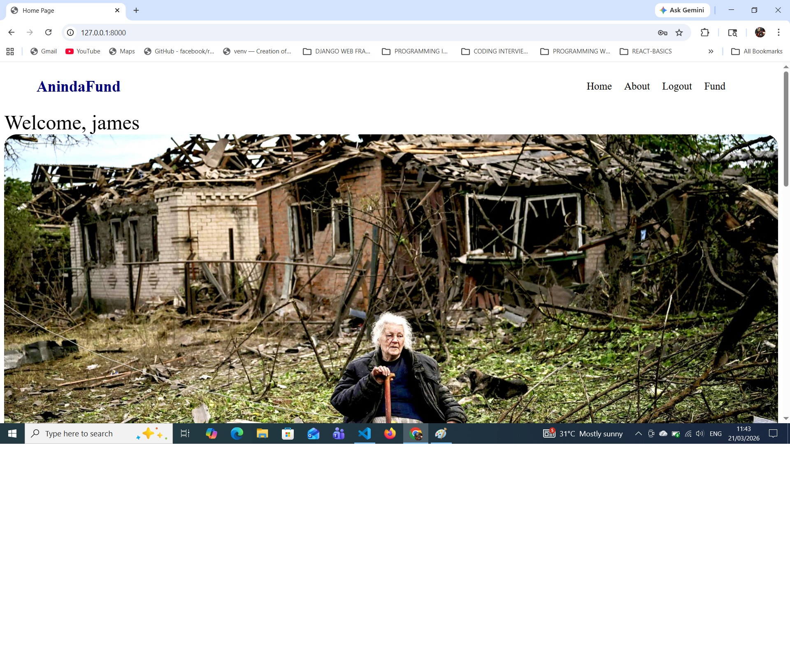
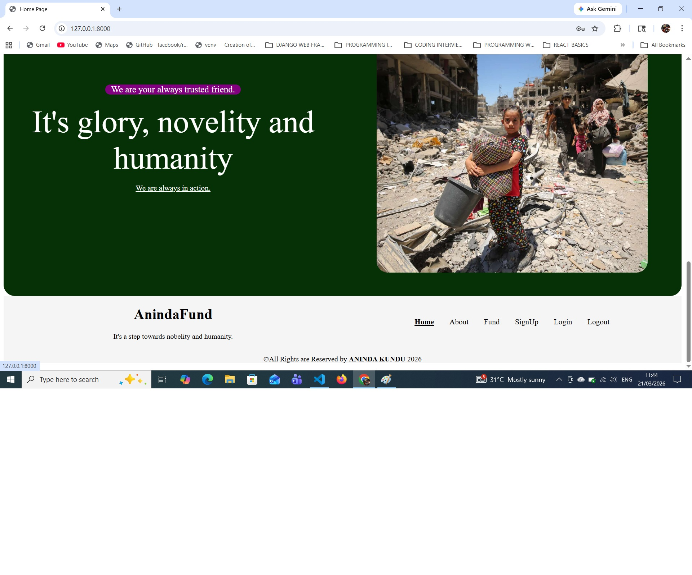
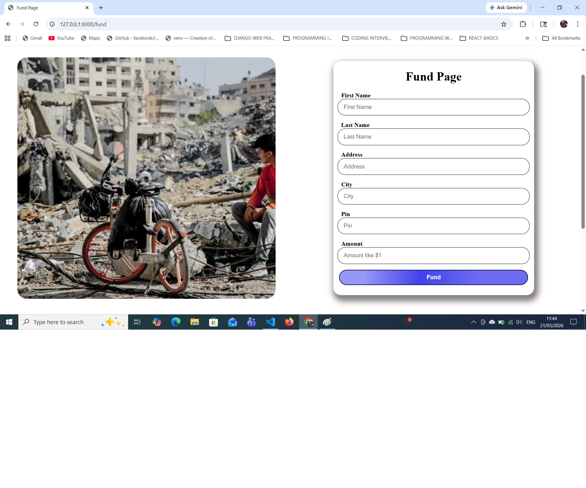
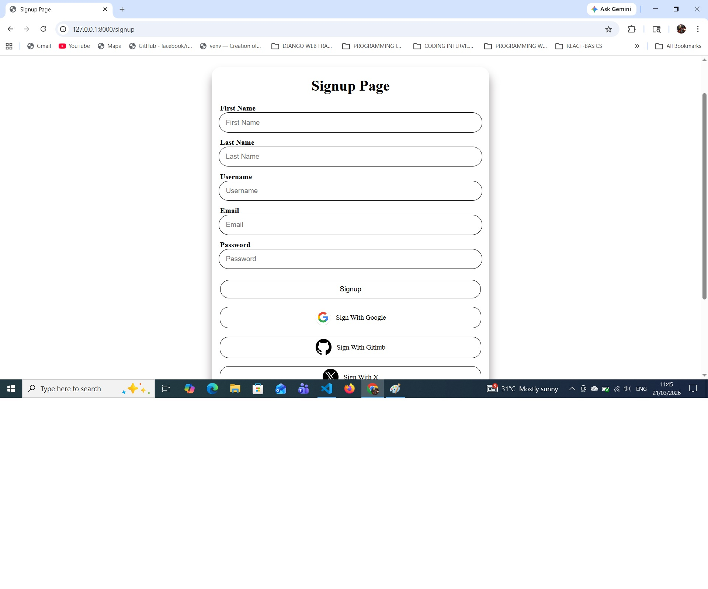
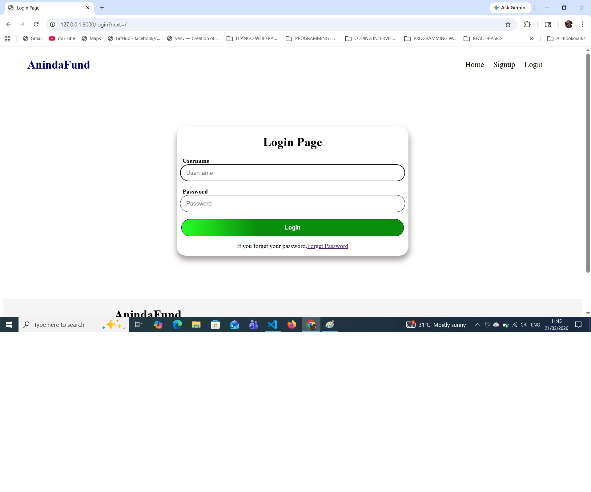

# This is ANINDA KUNDU's `Django Crowd Funding Web - app`.

I have used  **`Django`** and  **`Python`** for this project.

> In Front -End, I have used HTML, CSS and JavaScript.
> In Back -end I have used Django, Python, Sqlite and RESTApi.

This projects falls under my **Personal Licence**.

==Aninda's Crowd Funding Web - app==

#Some Screenshots are added

**Scrrenshot:**

**Screenshot 1:**

**Screenshot 2:**

**Screenshot 3:**

**Screenshot 4:**
